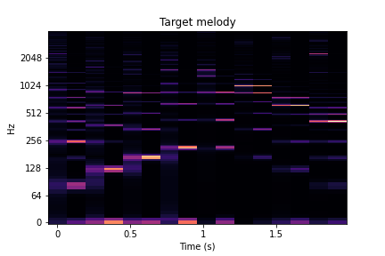
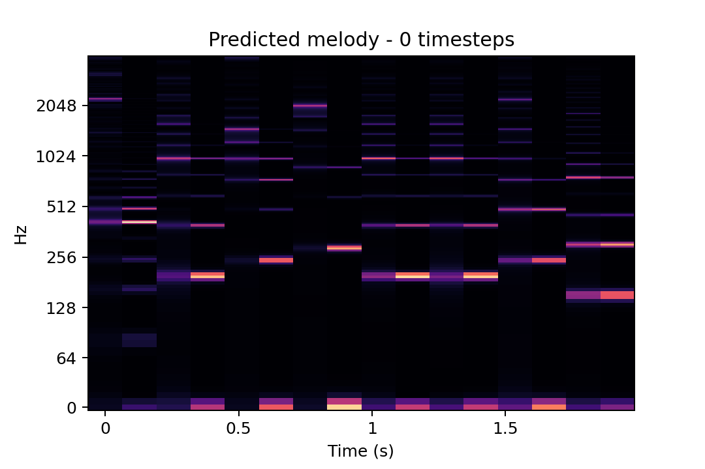
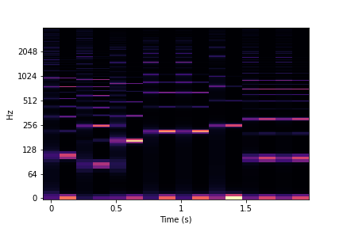
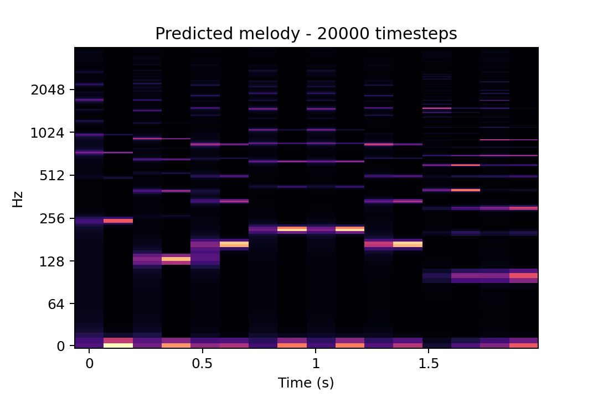
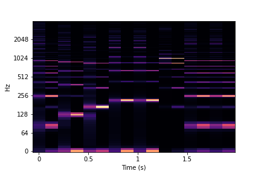
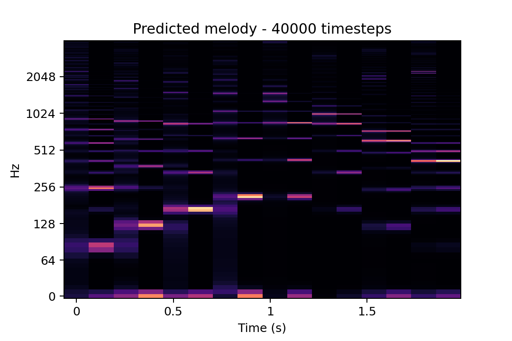
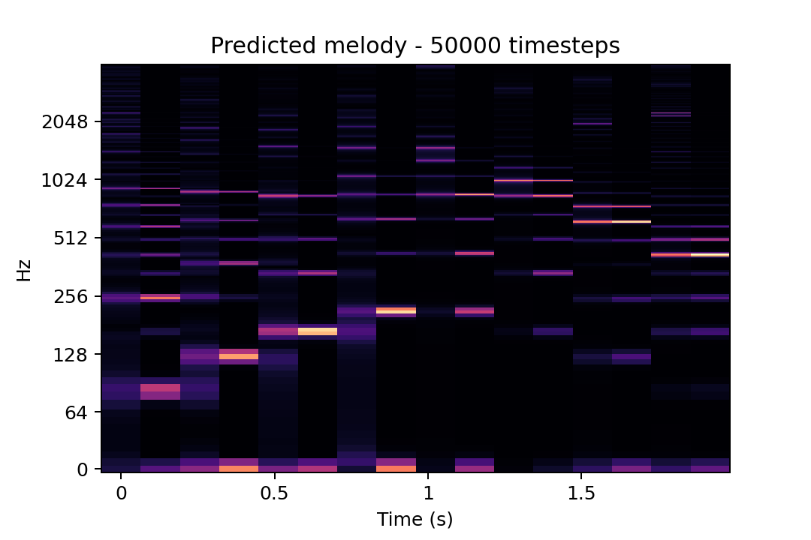
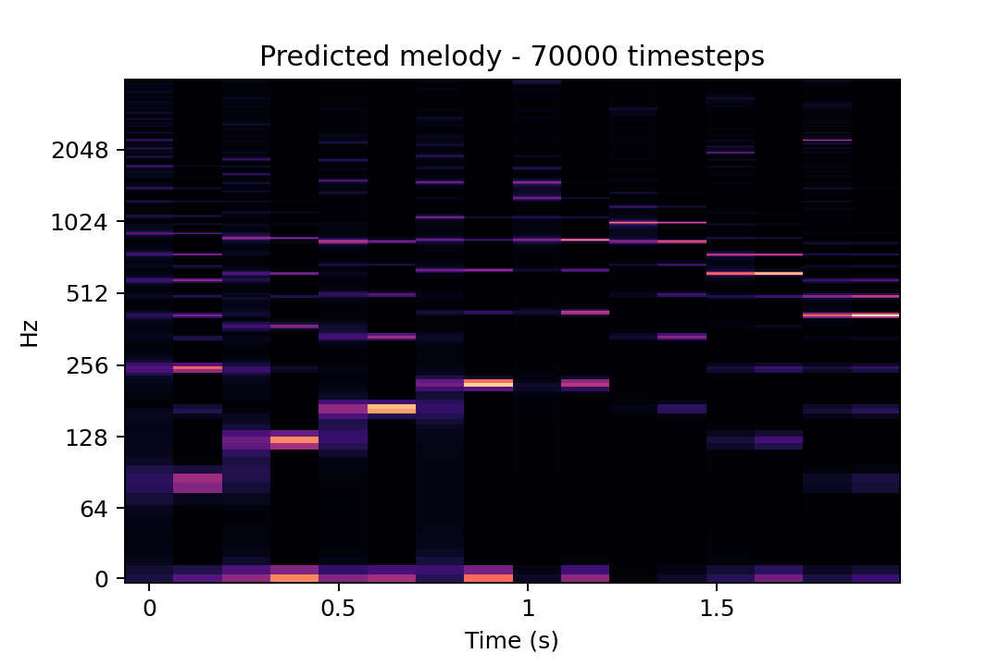

# Example of learning a Karplus-Strong melody

## Target Audio

#### Karplus-Strong parameters

| Note      | Frequency | Pluck position | Loss factor | Amplitude |
| --------- | --------- | -------------- | ----------- | --------- |
| 1         | 82        |  0.5           |  0.996      | 0.5       |
| 2         | 123       |  0.5           |  0.996      | 0.5       |
| 3         | 165       |  0.5           |  0.996      | 0.5       |
| 4         | 208       |  0.5           |  0.996      | 0.5       |
| 5         | 208       |  0.1           |  0.91       | 1.0       |
| 6         | 165       |  0.1           |  0.91       | 1.0       |
| 7         | 123       |  0.1           |  0.91       | 1.0       |
| 8         | 82        |  0.1           |  0.91       | 1.0       |

#### STFT

#### Audio

<audio controls>
  <source src="audio/target_audio.mp4" type="audio/wav">
</audio>

## Untrained prediction

#### Prediction score: 5.56

#### Karplus-Strong parameters

| Note      | Frequency | Pluck position | Loss factor | Amplitude |
| --------- | --------- | -------------- | ----------- | --------- |
| 1         | 82        |  0.1           |  0.91       | 0.5       |
| 2         | 195       |  0.3           |  0.91       | 1.0       |
| 3         | 240       |  0.1           |  0.91       | 1.0       |
| 4         | 282       |  0.1           |  0.91       | 1.0       |
| 5         | 195       |  0.3           |  0.996      | 1.0       |
| 6         | 195       |  0.3           |  0.91       | 1.0       |
| 7         | 237       |  0.3           |  0.91       | 0.5       |
| 8         | 149       |  0.3           |  0.91       | 1.0       |

#### STFT

#### Audio

<audio controls>
  <source src="audio/predicted_audio_0.mp4" type="audio/wav">
</audio>

## 10.000 timesteps

#### Prediction score: 6.28

#### Karplus-Strong parameters

| Note | Frequency | Pluck position | Loss factor | Amplitude |
| ---- |-----------|----------------|-------------|-----------|
| 1    | 106.0     | 0.5            | 0.91        | 0.5       |
| 2    | 83.0      | 0.5            | 0.996       | 0.5       |
| 3    | 162.0     | 0.5            | 0.91        | 0.5       |
| 4    | 209.0     | 0.5            | 0.91        | 0.5       |
| 5    | 209.0     | 0.5            | 0.91        | 0.5       |
| 6    | 249.0     | 0.5            | 0.91        | 1.0       |
| 7    | 99.0      | 0.5            | 0.91        | 1.0       |
| 8    | 99.0      | 0.5            | 0.91        | 0.5       |

#### STFT

#### Audio

<audio controls>
  <source src="audio/predicted_audio_10k.mp4" type="audio/wav">
</audio>

## 20.000 timesteps

#### Prediction score: 6.65

#### Karplus-Strong parameters

| Note | Frequency | Pluck position | Loss factor | Amplitude |
| ---- |-----------|----------------|-------------|-----------|
| 1    | 241.0     | 0.5            | 0.91        | 0.5       |
| 2    | 130.0     | 0.5            | 0.996       | 0.5       |
| 3    | 164.0     | 0.5            | 0.91        | 0.5       |
| 4    | 209.0     | 0.5            | 0.91        | 0.5       |
| 5    | 209.0     | 0.5            | 0.91        | 1.0       |
| 6    | 164.0     | 0.5            | 0.91        | 1.0       |
| 7    | 99.0      | 0.1            | 0.91        | 1.0       |
| 8    | 99.0      | 0.5            | 0.91        | 1.0       |

#### STFT

#### Audio

<audio controls>
  <source src="audio/predicted_audio_20k.mp4" type="audio/wav">
</audio>

## 30.000 timesteps

#### Prediction score: 7.25

#### Karplus-Strong parameters

| Note | Frequency | Pluck position | Loss factor | Amplitude |
| ---- |-----------|----------------|-------------|-----------|
| 1    | 83.0      | 0.5            | 0.91        | 0.5       |
| 2    | 125.0     | 0.5            | 0.996       | 0.5       |
| 3    | 164.0     | 0.5            | 0.91        | 0.5       |
| 4    | 209.0     | 0.5            | 0.91        | 0.5       |
| 5    | 209.0     | 0.5            | 0.91        | 0.5       |
| 6    | 164.0     | 0.1            | 0.91        | 1.0       |
| 7    | 83.0      | 0.5            | 0.91        | 1.0       |
| 8    | 83.0      | 0.5            | 0.91        | 1.0       |

#### STFT

#### Audio

<audio controls>
  <source src="audio/predicted_audio_30k.mp4" type="audio/wav">
</audio>

## 40.000 timesteps

#### Prediction score: 7.78

#### Karplus-Strong parameters

| Note | Frequency | Pluck position | Loss factor | Amplitude |
|------|-----------|----------------|-------------|-----------|
| 1    | 83.0      | 0.5            | 0.996       | 0.5       |
| 2    | 125.0     | 0.5            | 0.996       | 0.5       |
| 3    | 164.0     | 0.5            | 0.996       | 0.5       |
| 4    | 209.0     | 0.5            | 0.91        | 0.5       |
| 5    | 209.0     | 0.1            | 0.91        | 0.5       |
| 6    | 164.0     | 0.1            | 0.91        | 1.0       |
| 7    | 121.0     | 0.1            | 0.91        | 1.0       |
| 8    | 83.0      | 0.1            | 0.91        | 1.0       |

#### STFT

#### Audio

<audio controls>
  <source src="audio/predicted_audio_40k.mp4" type="audio/wav">
</audio>

## 50.000 timesteps

#### Prediction score: 7.85

#### Karplus-Strong parameters

| Note | Frequency | Pluck position | Loss factor | Amplitude |
|------|-----------|----------------|-------------|-----------|
| 1    | 83.0      | 0.5            | 0.996       | 0.5       |
| 2    | 125.0     | 0.5            | 0.996       | 0.5       |
| 3    | 164.0     | 0.5            | 0.996       | 0.5       |
| 4    | 209.0     | 0.5            | 0.91        | 0.5       |
| 5    | 209.0     | 0.1            | 0.91        | 0.5       |
| 6    | 164.0     | 0.1            | 0.91        | 1.0       |
| 7    | 123.0     | 0.1            | 0.91        | 1.0       |
| 8    | 83.0      | 0.1            | 0.91        | 1.0       |

#### STFT

#### Audio

<audio controls>
  <source src="audio/predicted_audio_50k.mp4" type="audio/wav">
</audio>

## 60.000 timesteps

#### Prediction score: 7.92

#### Karplus-Strong parameters

| Note | Frequency | Pluck position | Loss factor | Amplitude |
|------|-----------|----------------|-------------|-----------|
| 1    | 83.0      | 0.5            | 0.996       | 0.5       |
| 2    | 125.0     | 0.5            | 0.996       | 0.5       |
| 3    | 164.0     | 0.5            | 0.996       | 0.5       |
| 4    | 209.0     | 0.5            | 0.996       | 0.5       |
| 5    | 209.0     | 0.1            | 0.91        | 1.0       |
| 6    | 164.0     | 0.1            | 0.91        | 1.0       |
| 7    | 123.0     | 0.1            | 0.91        | 1.0       |
| 8    | 82.0      | 0.1            | 0.91        | 1.0       |

#### STFT

#### Audio

<audio controls>
  <source src="audio/predicted_audio_60k.mp4" type="audio/wav">
</audio>

## 70.000 timesteps

#### Prediction score: 8.00

#### Karplus-Strong parameters

| Note | Frequency | Pluck position | Loss factor | Amplitude |
|------|-----------|----------------|-------------|-----------|
| 1    | 82.0      | 0.5            | 0.996       | 0.5       |
| 2    | 122.0     | 0.5            | 0.996       | 0.5       |
| 3    | 164.0     | 0.5            | 0.996       | 0.5       |
| 4    | 209.0     | 0.5            | 0.996       | 0.5       |
| 5    | 209.0     | 0.1            | 0.91        | 1.0       |
| 6    | 164.0     | 0.1            | 0.91        | 1.0       |
| 7    | 123.0     | 0.1            | 0.91        | 1.0       |
| 8    | 82.0      | 0.1            | 0.91        | 1.0       |

#### STFT

#### Audio

<audio controls>
  <source src="audio/predicted_audio_70k.mp4" type="audio/wav">
</audio>

