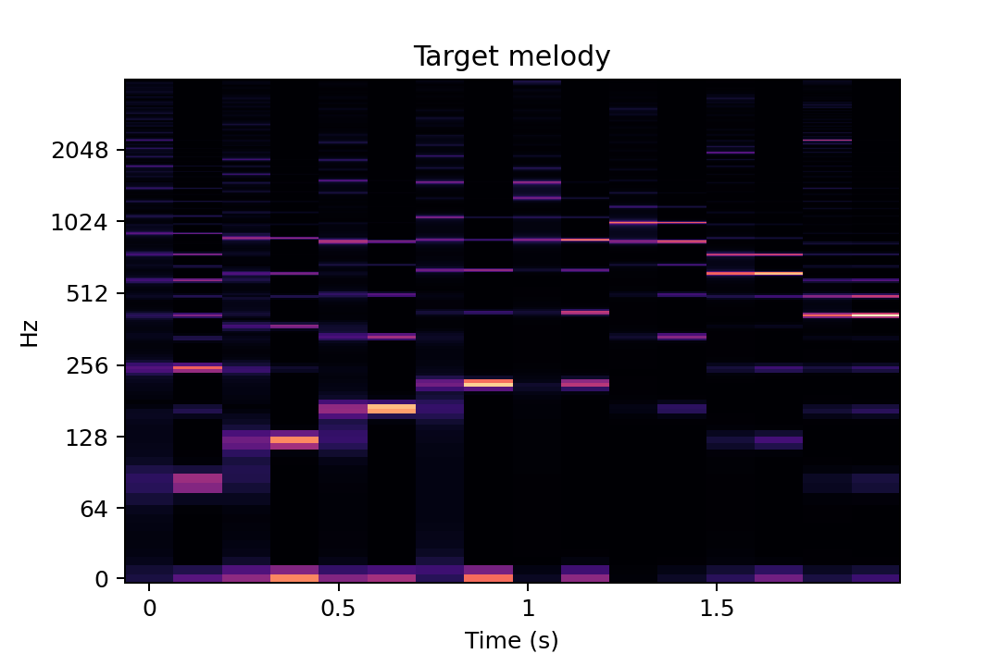
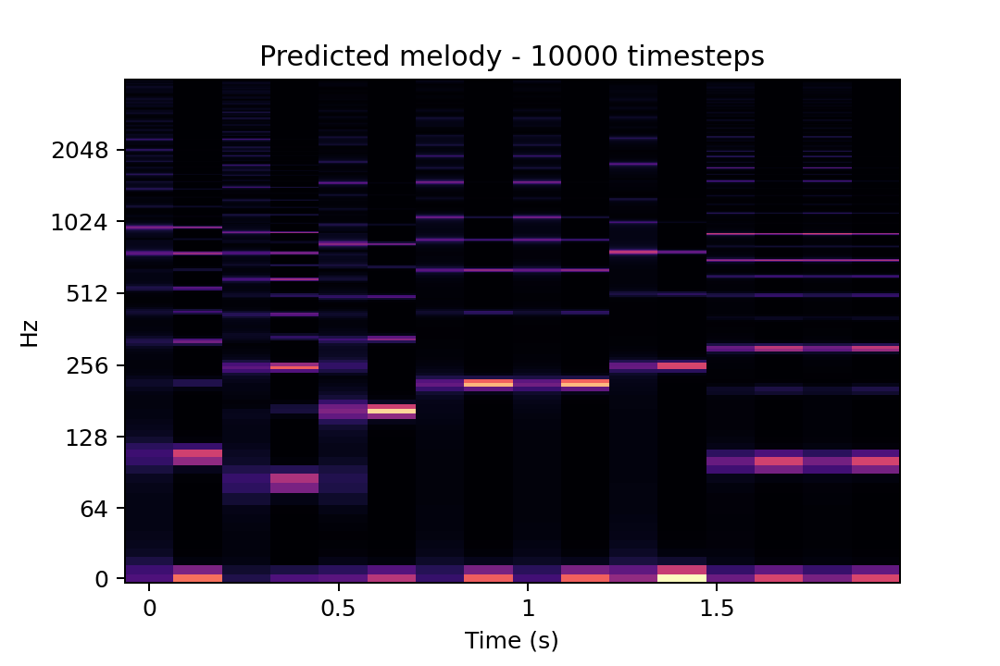
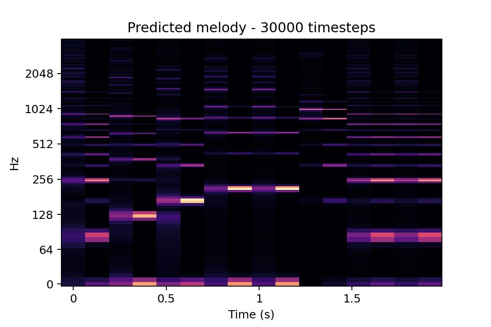

# Example of learning a Karplus-Strong melody

## Target Audio

#### Karplus-Strong parameters

| Note      | Frequency | Pluck position | Loss factor | Amplitude |
| --------- | --------- | -------------- | ----------- | --------- |
| 1         | 82        |  0.5           |  0.996      | 0.5       |
| 2         | 123       |  0.5           |  0.996      | 0.5       |
| 3         | 165       |  0.5           |  0.996      | 0.5       |
| 4         | 208       |  0.5           |  0.996      | 0.5       |
| 5         | 208       |  0.1           |  0.91       | 1.0       |
| 6         | 165       |  0.1           |  0.91       | 1.0       |
| 7         | 123       |  0.1           |  0.91       | 1.0       |
| 8         | 82        |  0.1           |  0.91       | 1.0       |

#### STFT

#### Audio

<audio controls>
  <source src="audio/target_audio.mp4" type="audio/wav">
</audio>

## Untrained prediction

#### Karplus-Strong parameters

| Note      | Frequency | Pluck position | Loss factor | Amplitude |
| --------- | --------- | -------------- | ----------- | --------- |
| 1         | 82        |  0.5           |  0.996      | 0.5       |
| 2         | 123       |  0.5           |  0.996      | 0.5       |
| 3         | 165       |  0.5           |  0.996      | 0.5       |
| 4         | 208       |  0.5           |  0.996      | 0.5       |
| 5         | 208       |  0.1           |  0.91       | 1.0       |
| 6         | 165       |  0.1           |  0.91       | 1.0       |
| 7         | 123       |  0.1           |  0.91       | 1.0       |
| 8         | 82        |  0.1           |  0.91       | 1.0       |

#### STFT

#### Audio

<audio controls>
  <source src="audio/predicted_audio_0.mp4" type="audio/wav">
</audio>

## 10.000 timesteps

#### Karplus-Strong parameters

| Note      | Frequency | Pluck position | Loss factor | Amplitude |
| --------- | --------- | -------------- | ----------- | --------- |
| 1         | 82        |  0.5           |  0.996      | 0.5       |
| 2         | 123       |  0.5           |  0.996      | 0.5       |
| 3         | 165       |  0.5           |  0.996      | 0.5       |
| 4         | 208       |  0.5           |  0.996      | 0.5       |
| 5         | 208       |  0.1           |  0.91       | 1.0       |
| 6         | 165       |  0.1           |  0.91       | 1.0       |
| 7         | 123       |  0.1           |  0.91       | 1.0       |
| 8         | 82        |  0.1           |  0.91       | 1.0       |

#### STFT

#### Audio

<audio controls>
  <source src="audio/predicted_audio_10k.mp4" type="audio/wav">
</audio>

## 20.000 timesteps

#### Karplus-Strong parameters

| Note      | Frequency | Pluck position | Loss factor | Amplitude |
| --------- | --------- | -------------- | ----------- | --------- |
| 1         | 82        |  0.5           |  0.996      | 0.5       |
| 2         | 123       |  0.5           |  0.996      | 0.5       |
| 3         | 165       |  0.5           |  0.996      | 0.5       |
| 4         | 208       |  0.5           |  0.996      | 0.5       |
| 5         | 208       |  0.1           |  0.91       | 1.0       |
| 6         | 165       |  0.1           |  0.91       | 1.0       |
| 7         | 123       |  0.1           |  0.91       | 1.0       |
| 8         | 82        |  0.1           |  0.91       | 1.0       |

#### STFT

#### Audio

<audio controls>
  <source src="audio/predicted_audio_20k.mp4" type="audio/wav">
</audio>

## 30.000 timesteps

#### Karplus-Strong parameters

| Note      | Frequency | Pluck position | Loss factor | Amplitude |
| --------- | --------- | -------------- | ----------- | --------- |
| 1         | 82        |  0.5           |  0.996      | 0.5       |
| 2         | 123       |  0.5           |  0.996      | 0.5       |
| 3         | 165       |  0.5           |  0.996      | 0.5       |
| 4         | 208       |  0.5           |  0.996      | 0.5       |
| 5         | 208       |  0.1           |  0.91       | 1.0       |
| 6         | 165       |  0.1           |  0.91       | 1.0       |
| 7         | 123       |  0.1           |  0.91       | 1.0       |
| 8         | 82        |  0.1           |  0.91       | 1.0       |

#### STFT

#### Audio

<audio controls>
  <source src="audio/predicted_audio_30k.mp4" type="audio/wav">
</audio>

## 40.000 timesteps

#### Karplus-Strong parameters

| Note      | Frequency | Pluck position | Loss factor | Amplitude |
| --------- | --------- | -------------- | ----------- | --------- |
| 1         | 82        |  0.5           |  0.996      | 0.5       |
| 2         | 123       |  0.5           |  0.996      | 0.5       |
| 3         | 165       |  0.5           |  0.996      | 0.5       |
| 4         | 208       |  0.5           |  0.996      | 0.5       |
| 5         | 208       |  0.1           |  0.91       | 1.0       |
| 6         | 165       |  0.1           |  0.91       | 1.0       |
| 7         | 123       |  0.1           |  0.91       | 1.0       |
| 8         | 82        |  0.1           |  0.91       | 1.0       |

#### STFT

#### Audio

<audio controls>
  <source src="audio/predicted_audio_40k.mp4" type="audio/wav">
</audio>

## 50.000 timesteps

#### Karplus-Strong parameters

| Note      | Frequency | Pluck position | Loss factor | Amplitude |
| --------- | --------- | -------------- | ----------- | --------- |
| 1         | 82        |  0.5           |  0.996      | 0.5       |
| 2         | 123       |  0.5           |  0.996      | 0.5       |
| 3         | 165       |  0.5           |  0.996      | 0.5       |
| 4         | 208       |  0.5           |  0.996      | 0.5       |
| 5         | 208       |  0.1           |  0.91       | 1.0       |
| 6         | 165       |  0.1           |  0.91       | 1.0       |
| 7         | 123       |  0.1           |  0.91       | 1.0       |
| 8         | 82        |  0.1           |  0.91       | 1.0       |

#### STFT

#### Audio

<audio controls>
  <source src="audio/predicted_audio_50k.mp4" type="audio/wav">
</audio>

## 60.000 timesteps

#### Karplus-Strong parameters

| Note      | Frequency | Pluck position | Loss factor | Amplitude |
| --------- | --------- | -------------- | ----------- | --------- |
| 1         | 82        |  0.5           |  0.996      | 0.5       |
| 2         | 123       |  0.5           |  0.996      | 0.5       |
| 3         | 165       |  0.5           |  0.996      | 0.5       |
| 4         | 208       |  0.5           |  0.996      | 0.5       |
| 5         | 208       |  0.1           |  0.91       | 1.0       |
| 6         | 165       |  0.1           |  0.91       | 1.0       |
| 7         | 123       |  0.1           |  0.91       | 1.0       |
| 8         | 82        |  0.1           |  0.91       | 1.0       |

#### STFT

#### Audio

<audio controls>
  <source src="audio/predicted_audio_60k.mp4" type="audio/wav">
</audio>

## 70.000 timesteps

#### Karplus-Strong parameters

| Note      | Frequency | Pluck position | Loss factor | Amplitude |
| --------- | --------- | -------------- | ----------- | --------- |
| 1         | 82        |  0.5           |  0.996      | 0.5       |
| 2         | 123       |  0.5           |  0.996      | 0.5       |
| 3         | 165       |  0.5           |  0.996      | 0.5       |
| 4         | 208       |  0.5           |  0.996      | 0.5       |
| 5         | 208       |  0.1           |  0.91       | 1.0       |
| 6         | 165       |  0.1           |  0.91       | 1.0       |
| 7         | 123       |  0.1           |  0.91       | 1.0       |
| 8         | 82        |  0.1           |  0.91       | 1.0       |

#### STFT

#### Audio

<audio controls>
  <source src="audio/predicted_audio_70k.mp4" type="audio/wav">
</audio>

